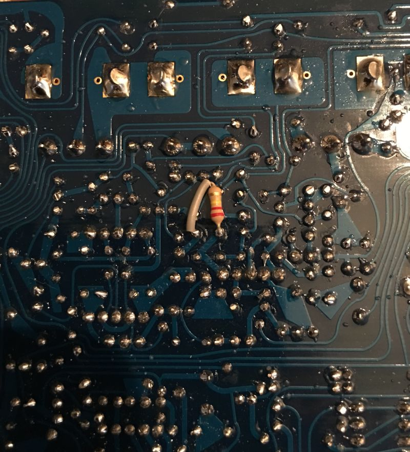

When Roland made the TB-303 there was not really any thought of audio fidelity. It was more about creating products based on existing technology. There are at least three variants of transistors known to have been used in the short production run. There could have been more, there simply is not enough available data.

So essentially all TB-303s are dice rolls, the components were not specifically picked, there was no voodoo involved. What this leads to is quite some swing between machines. Over the years many have passed my bench and all sound great but some sound incredible.

The mother machine that was used to create the RE-303 is a good example of a stock 303, but I also have another (whitey) that just sounds incredible. Why is that? It’s not really totally clear to anyone and it leads to lot of speculation and the inevitable voodoo tricks.

So I came up with the dice roll concept, you just build your machine and do one tweak.

&nbsp;

220K resistor in parallel with R97

That’s it? Pretty much, it drives the resonance a bit more and to me it’s that little extra difference you could have between a good 303 and an awesome one from the factory.
Of course ymmv :-P
