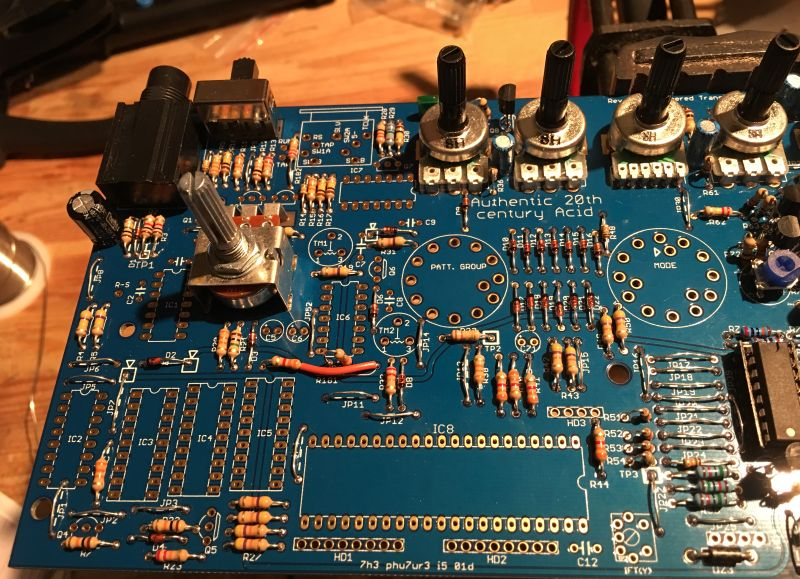

Fit the diodes and resistors. Note the extra insulation on R181.

&nbsp;

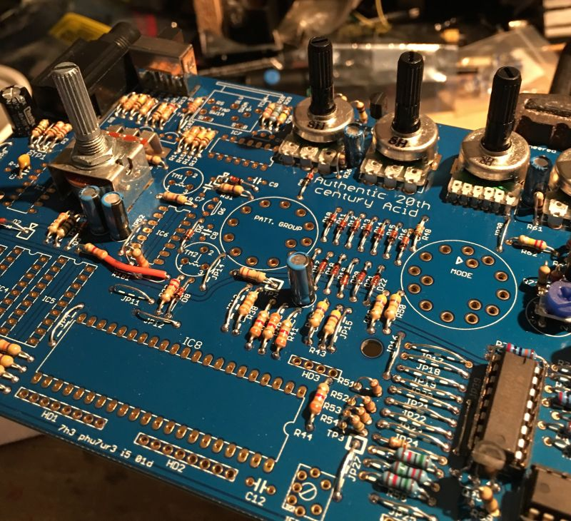

Fit all the electrolytic capacitors.

&nbsp;

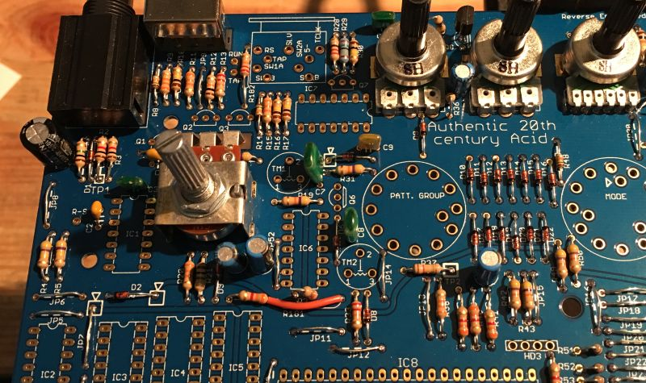

Fit the metal film capacitors.

&nbsp;

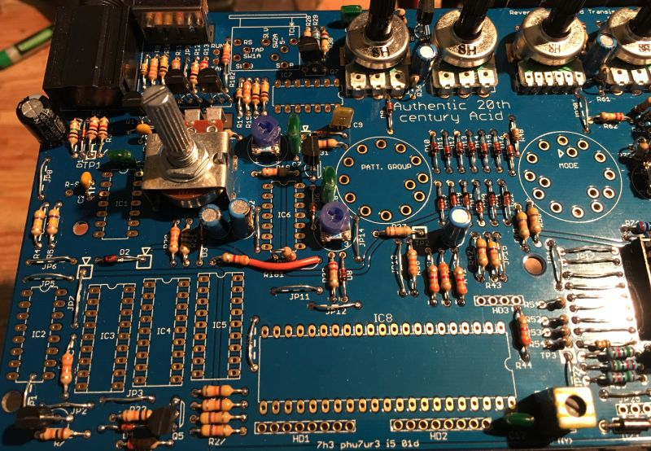

Fit the transistors, trimmers and yellow IFT coil.

&nbsp;

**About the switching sync socket**

Unfortunately this part is obsolete, the only option is to fabricate the part from existing materials. Any standard 5-pin din pcb mount connector should be fine for the socket section. However the front ground pins and couling usually have to be trimmed as shown in the following pics.

&nbsp;

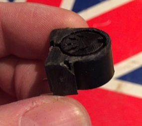

This used to be an adafruit din socket.

&nbsp;

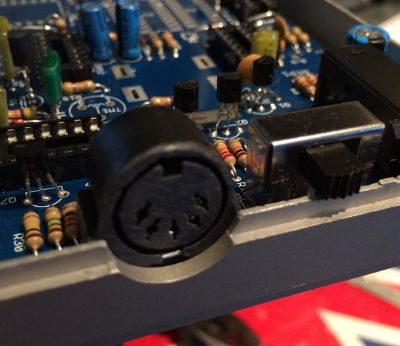

Here it is fitted.
  
&nbsp;

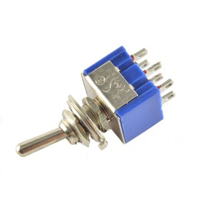

For the switch part you can simply use a standard DPDT switch.

&nbsp;

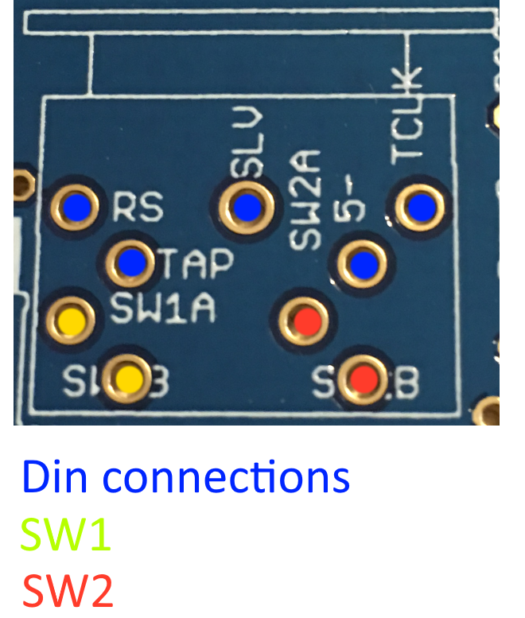

Wire SW1 and SW2 to the DPDT so that they are both switched on or off in unison.

&nbsp;

**Fit the rotary switches**

&nbsp;

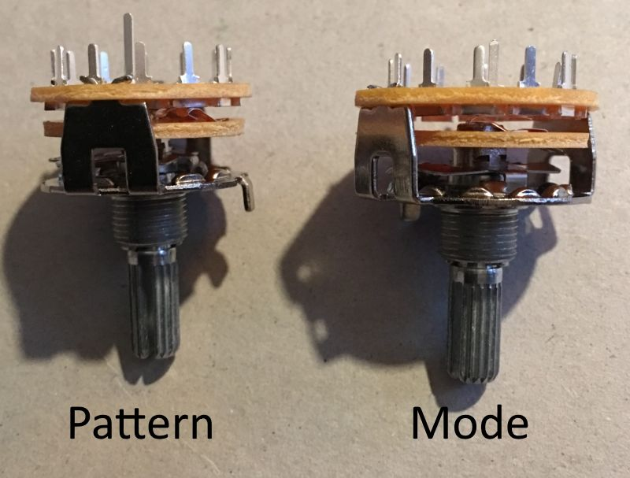

Notice the pattern switch not only has more clicks but also has a longer switch pin.

&nbsp;

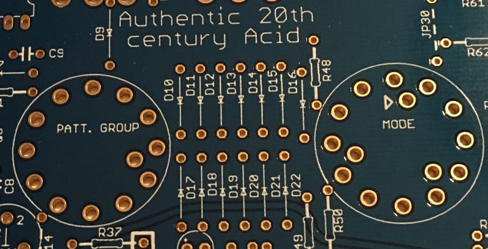

The pattern switch can only go one way but pay attention when fitting the mode switch. The switch pin must fit where the hole is marked with a triangle. **Read on before fitting.** 

&nbsp;

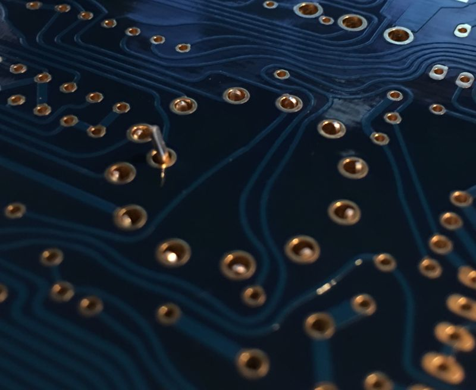  

Fit the switch but do not push it down too far, try to keep the rotary pins even to the top of the pads as shown above.

&nbsp;

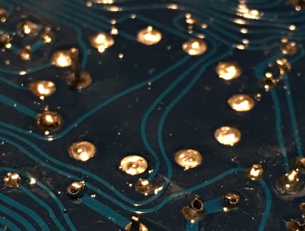

Solder only the switch pin and then form the part to the correct place and solder the rotary pins. Repeat for both switches. If you are fitting a real 303 case etc you might want to test fit and form before soldering the rotary pins. Don’t worry if you can’t line them up perfectly, Roland wasn’t able to do that either ;-)
 
Now that’s done take a moment to check your work, make sure nothing is missing and that there are no solder shorts or splashes. If you are satisfied then the digital section is done except for the IC’s. We will fit them after the switchboard is completed.