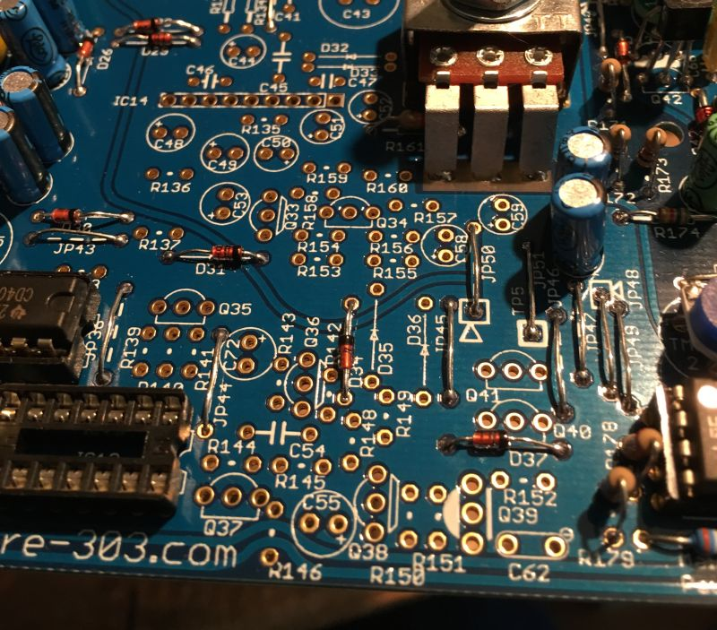
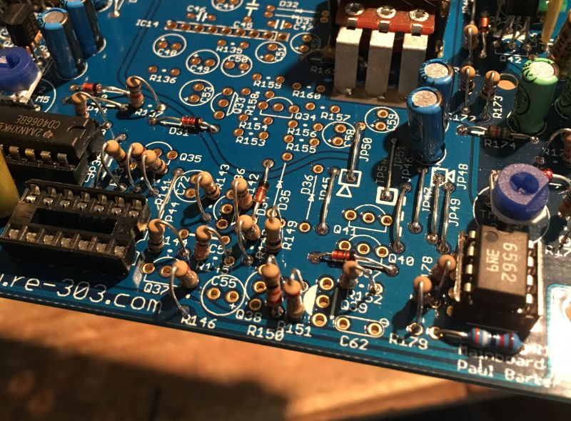
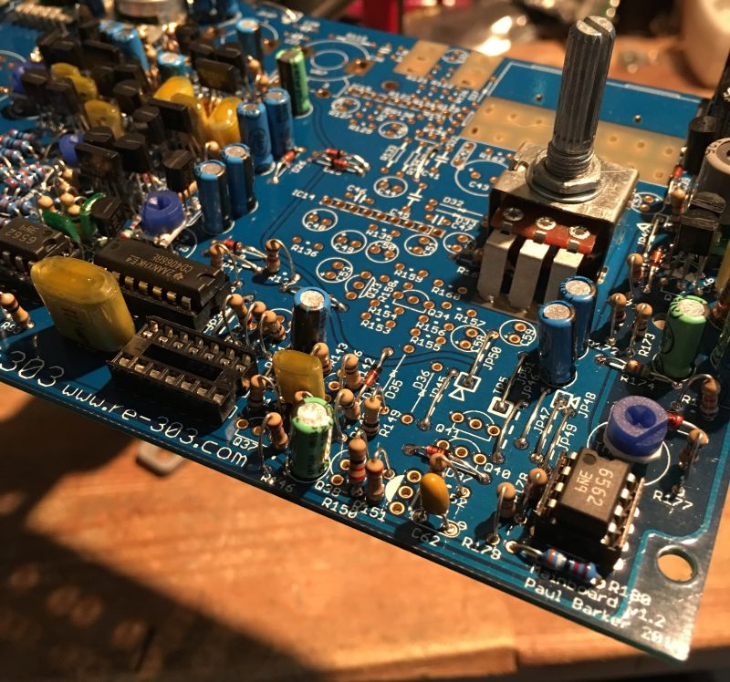
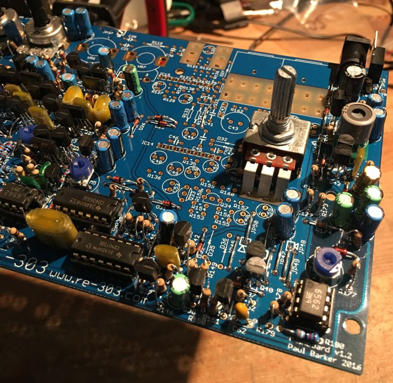

Fit the diodes.

&nbsp;

Fit the resistors.

&nbsp;

Fit the metal film, electrolytic and tantalum capacitors.

Don’t forget that the electrolytic and tantalum capacitors are polarised. The black band on the electrolytic is negative (short leg). The tantalums positive legs are marked. The silkscreen for the tantalum shows a negative symbol so be sure NOT to place the positive end into the negative side.

Double check or experience fire! :-O

&nbsp;

Fit the transistors

After you have fit the transistors you can place VR6.

Take a moment to check your work, make sure nothing is missing and that there are no solder shorts or splashes. If you are satisfied then it’s time to move on since we will test this section after the Mixer/Headphone section is built.