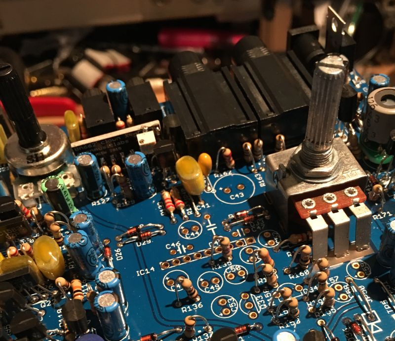
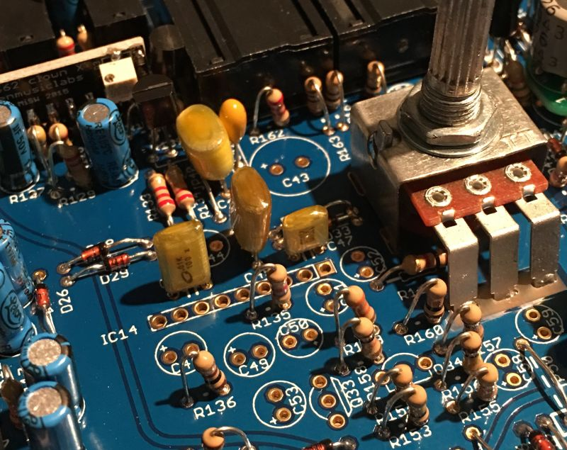
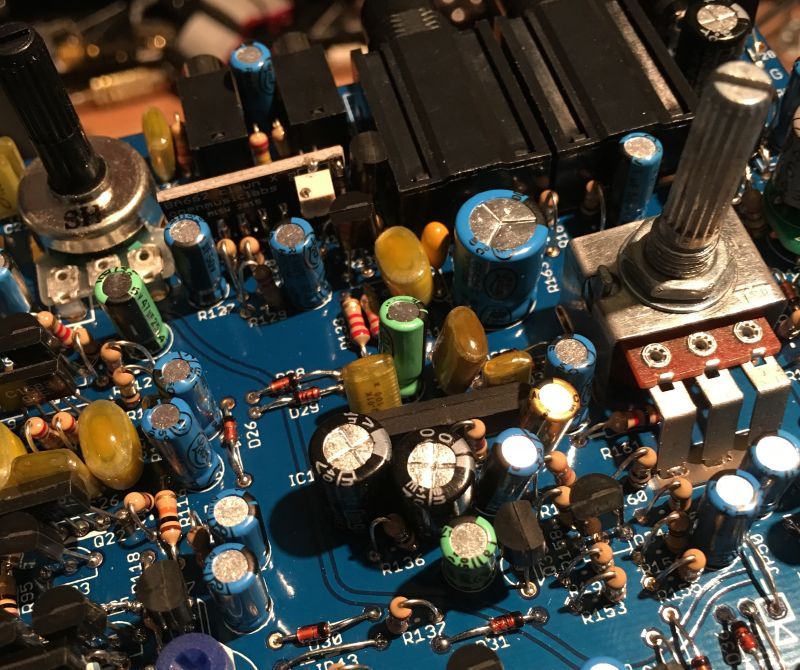

Fit the diodes and resistors. R161 was fitted in the preparation stage.

&nbsp;

Fit the film capacitors.

&nbsp;

Fit the remaining parts. Note that the slanted edge of the LA4140 designates pin 1 and should be facing to the right (square hole in IC14 pcb footprint)

Take a moment to check your work, make sure nothing is missing and that there are no solder shorts or splashes. If you are satisfied then it’s time to test the last three sections all at once.