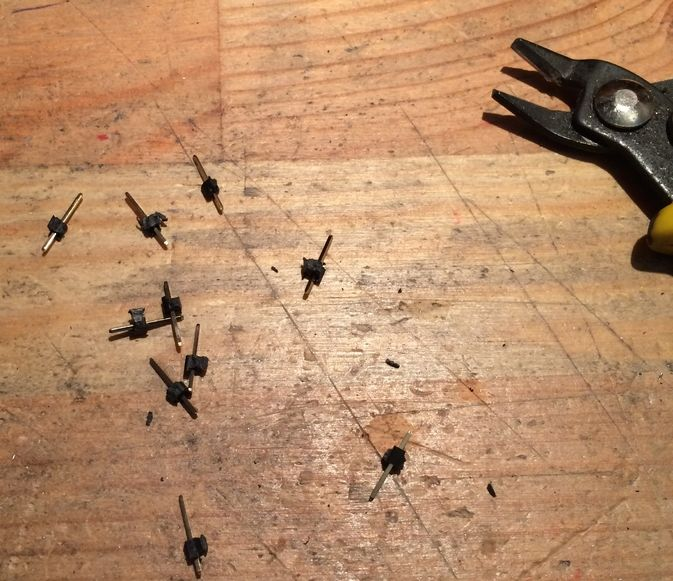
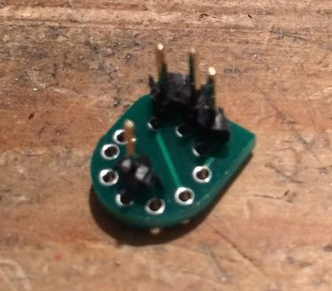
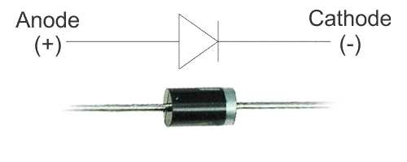

&nbsp;

CARE MUST BE TAKEN WITH THE COIL

The coil is a 30 year old "new old stock" part, so care should be taken when soldering, the pins themselves will not take much to break or overheat.

&nbsp;

Before we attach the coil, take the header

&nbsp;

And cut it up into single legs.

&nbsp;

Now place 4 pins with the long part into the hole in pin locations 1,2,3 and 7 as shown in the image.

&nbsp;

**DO NOT SOLDER ANYTHING
TO THE MAIN BOARD YET!**

(we are just using it to hold the pins for us)

&nbsp;

Now place the adaptor on top of the pins as shown. Check that the orientation is correct and that there is a clear place for the coil to sit.

If everything looks good, solder the adaptor to the pins.

&nbsp;

**DO NOT SOLDER ANYTHING TO THE MAIN BOARD YET**

&nbsp;

Remove the adaptor and check your work

&nbsp;

here's another angle

&nbsp;

Now place the adaptor on the coil as shown, **ONLY SOLDER ONE LEG** to the adaptor

BE SURE TO ALIGN PIN1 OF THE ADAPTOR (first pin in the gap) TO PIN 1 ON THE ADAPTOR (do not align the gap from the pin9 side, as there is an extra support pin next to pin 9 we don't use. It won’t fit directly this way but can be accidentally forced to fit.)

&nbsp;

**Note the empty hole between pin 1 and pin 9.**

&nbsp;

Now carefully heat that soldered pin and adjust so that the coil is straight and does not touch the adaptor anywhere and also that the legs of the coil do not protrude as to be able to touch the main board.

**DO NOT BEND IT STRAIGHT AS YOU MAY BREAK ONE OF THE PINS**

if it looks like the picture then solder the remaining pins.

&nbsp;

Inspect your work,

&nbsp;

|||
|---|---|

Now place the coil and adaptor on the main board.

&nbsp;

Note the orientation of the pointer.

&nbsp;

Solder and clip the 4 legs.

&nbsp;

ready for the next step.

&nbsp;

||
|:--:| 
| Adaptor reference |

&nbsp;

Fit the resistors.

&nbsp;

Fit the diodes.

&nbsp;

The diodes are polarised, be sure to match the band to the silkscreen

&nbsp;

Fit the transistors, check the silkscreen to make sure you orient them correctly

&nbsp;

Fit the capacitors.

The electrolytic are polarised. The long leg must go to the hole marked with the + symbol.
 
Finally solder TM6 and the DC jack, then carefully inspect your work so far. Make sure all the diodes and capacitors are the correct way. Check for solder bridges and mistakes. If everything looks ok, it’s time to test the power section.

Without IC16 fitted, connect a 9v DC linear regulated power supply (center pole negative) a guitar style 500ma is suitable .

Power on and measure voltage on the socket of IC16 pin 8. Your voltage should be around 15v DC.

&nbsp;

You can take the ground from one of the jack footprints as shown in the pic.
 
Did you get the expected voltage? If so, congratulations, you are well on your way. And can continue below.

If you don’t have the correct voltage, check that your power supply is the correct type, that it’s also working.

Did you turn on the power switch by rotating VR8 fully? Is something placed backwards? Finally did you solder the coil correctly? Check again for missing parts or solder bridges.

Once you have the correct reading, disconnect the power and place IC16.

&nbsp;

Reconnect the power supply, turn on the power again and measure from TP5 (this is jumper JP51). Adjust TM6 for 5.333v.

&nbsp;

Now measure from JP47 and you should see a voltage around 12v. As you can see mines a little shy of the 12v mark, this is normal and nothing to worry about.

If you have all the tested voltages then congratulations, you just completed the power supply section.