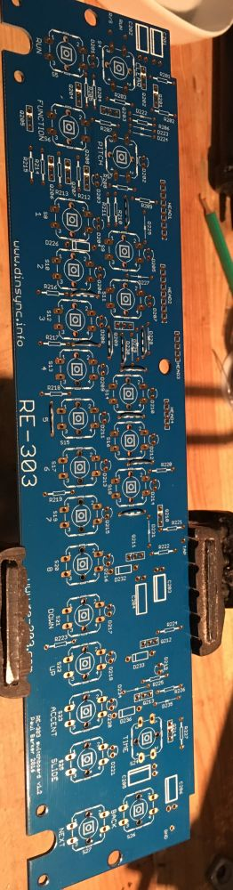

Fit the 11 jumpers.

&nbsp;

Fit the diodes.

&nbsp;

Fit the resistors.

&nbsp;

Fit the Electrolytic caps, make sure the negative bands match on the silkscreen.

&nbsp;

Fit the transistors.

&nbsp;

Fit the tact switches.

&nbsp;

Fit the leds with standoffs, note that D202 is fitted without standoff. Depending on what case you intend to use, it may be better for you to fit the LEDs once you are placing your unit into a case, therefore you may also not need the standoffs.

Q204 should be bent flat if using original style buttons.

As before, inspect you work. This section was quite straightforward so that’s actually extra reason to double check ;-)

If you are satisfied then it’s time to finish off the build.