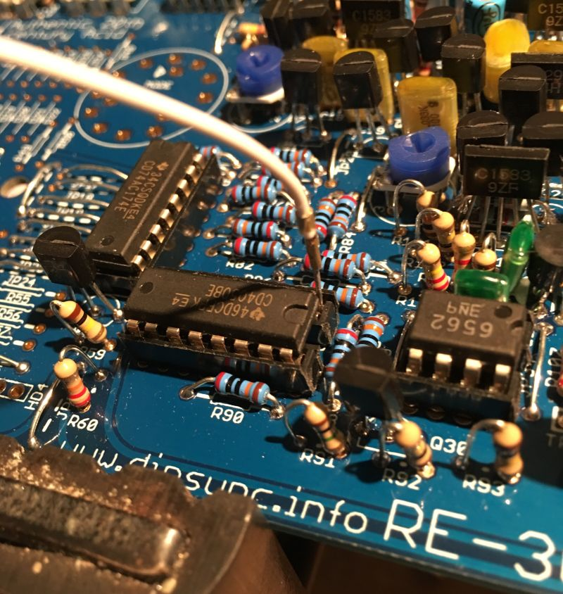

**DO NOT DO THIS TESTING PROCEDURE WITH A CPU FITTED**

Connect up the power as before.  
Ground R90 (if needed) to start the oscillator running.  
Connect audio out or headphones.

You will need a voltage source to test the gate, this can be taken from IC10 pin 1, connect one end of a test lead as shown in the above picture (this is the 5.333v reference and is enough to trigger the gate)

Touch the other end to the south side of R146, you should hear a note play, just like in this instagram video. Test both the audio out and headphone out in this way.

<a href="http://www.instagram.com/p/BMjRuHghctM/" target="_blank">http://www.instagram.com/p/BMjRuHghctM/</a>
  
If you don’t hear anything then try the other socket (audio out of headphone) If there is no signal at all then there may be a problem with the envelope or the vca.

To test if the envelope is firing you can scope Q39 pin3 and repeat the test, you should see an envelope with decay between 200ms and 2.5 sec (depending on the setting of the decay pot)

**If you don’t see the envelope** then the problem is most likely in the envelope section, review your work and try again.

**If you do see the envelope** then the problem is most likely after the envelope section, review your work in the VCA and Mix/Headphone sections and try again.

Once the test is completed we have finished the analog section.