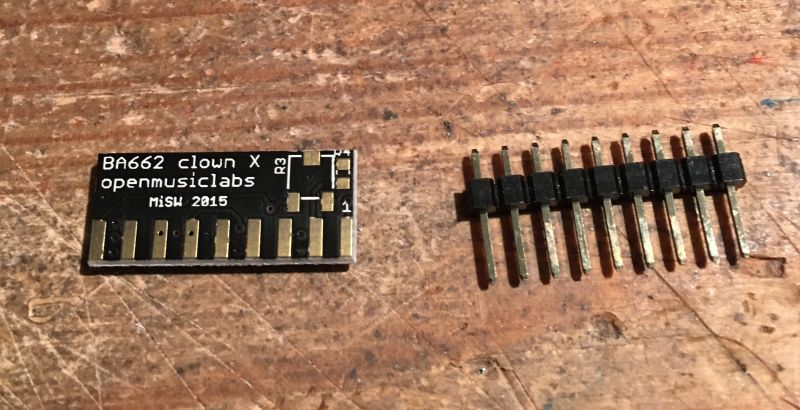
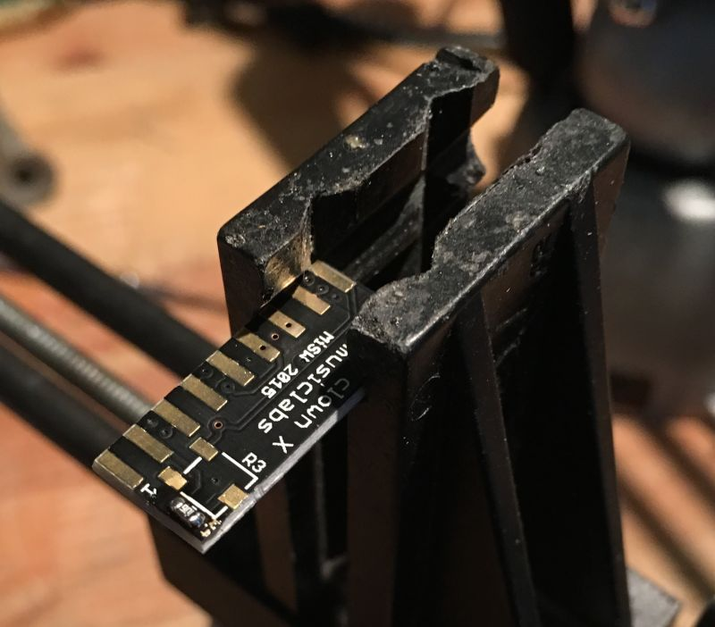
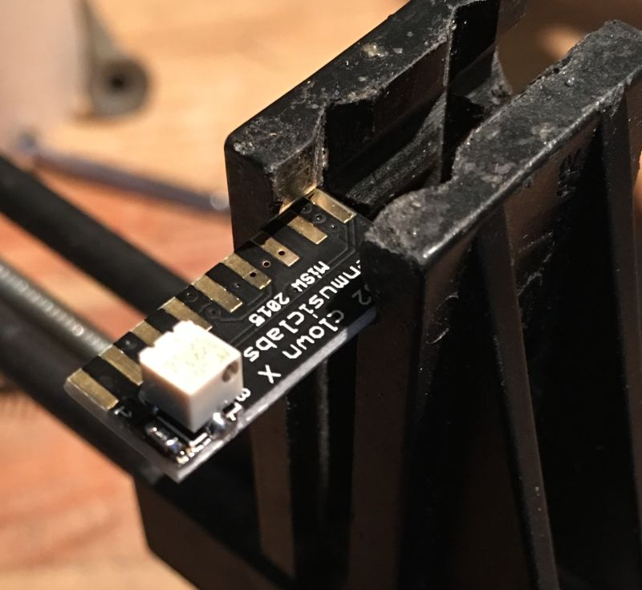
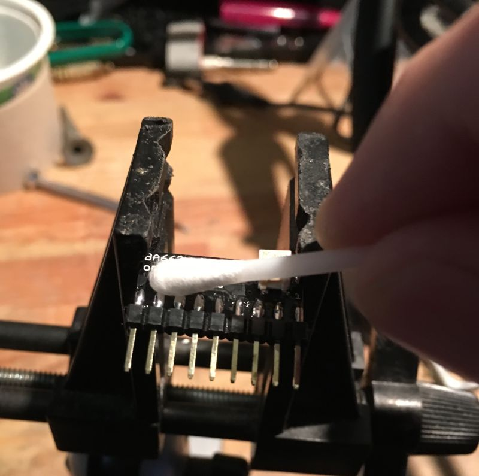
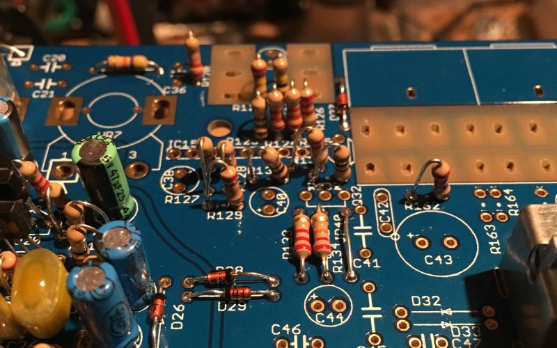
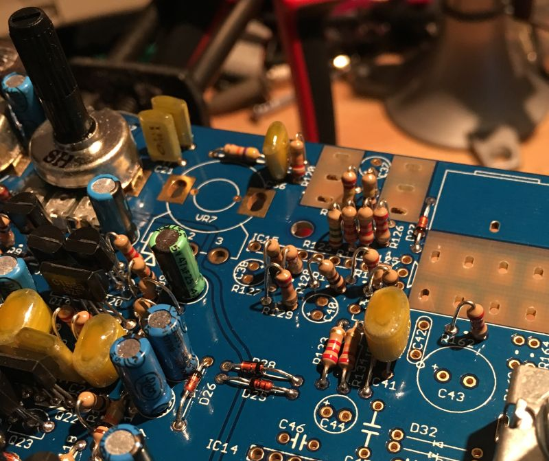
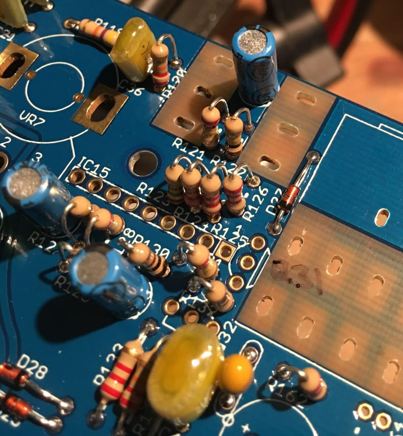
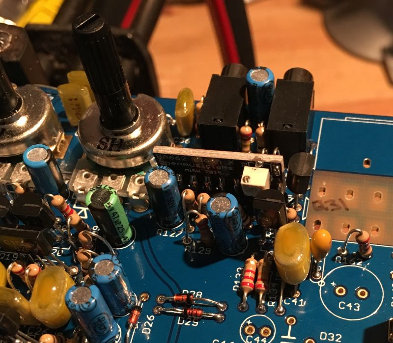

Before you attach the legs to the BA662 clown you should decide if you will fit the optional trimmer and resistor. It will be next to impossible to fit it later unless you place the BA662 clown in an IC socket..

The trimmer and resistor are not needed necessarily but can be fitted in order to trim DC offset thump (reducing clicking when notes are struck)

We recommend fitting these optional parts and doing so before fitting the legs..

&nbsp;

First fit the  10M chip resistor (mouser 311-10MGRCT-ND)

&nbsp;

Now fit the 50K trimmer (mouser 3223J-1-503ECT-ND)

&nbsp;

Fit the legs and clean away the leftover flux with some isopropanol. 

Set the chip aside until we need it later on.

&nbsp;

Fit the diodes and resistors.

&nbsp;

Fit the metal film capacitors.

&nbsp;

Fit the electrolytic capacitors and transistors.

Note that Q31 doesn’t have a designator, you can see it is the transistor to the right of IC15 and marked in pen in the above picture.

&nbsp;

Now you can fit the BA662, note the orientation (pin 1 is to the right in the above picture)

The clone hangs over the edge a little compared to the original chip and is close to the case post, take care not to hit the parts on the side of the chip when assembling with an original case.

Finally you can fit VR7, then the 3.5mm and 6.3mm jacks.

Take a moment to check your work, make sure nothing is missing and that there are no solder shorts or splashes. If you are satisfied then it’s time to move on since we will test this section after the Mixer/Headphone section is built.