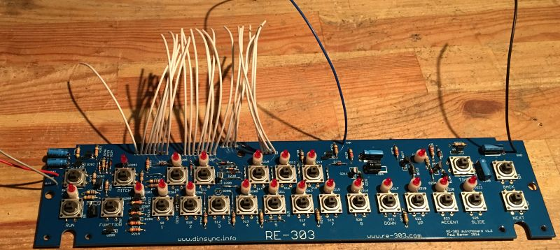
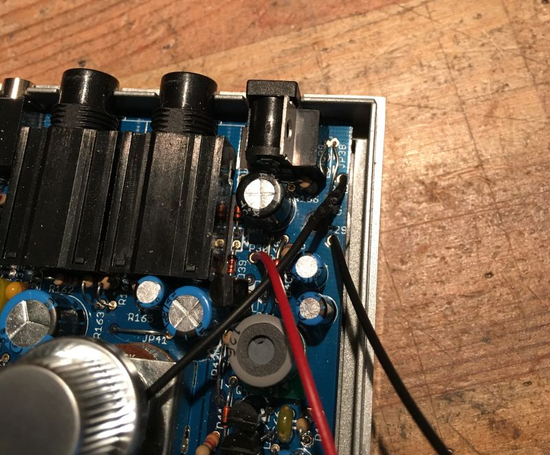
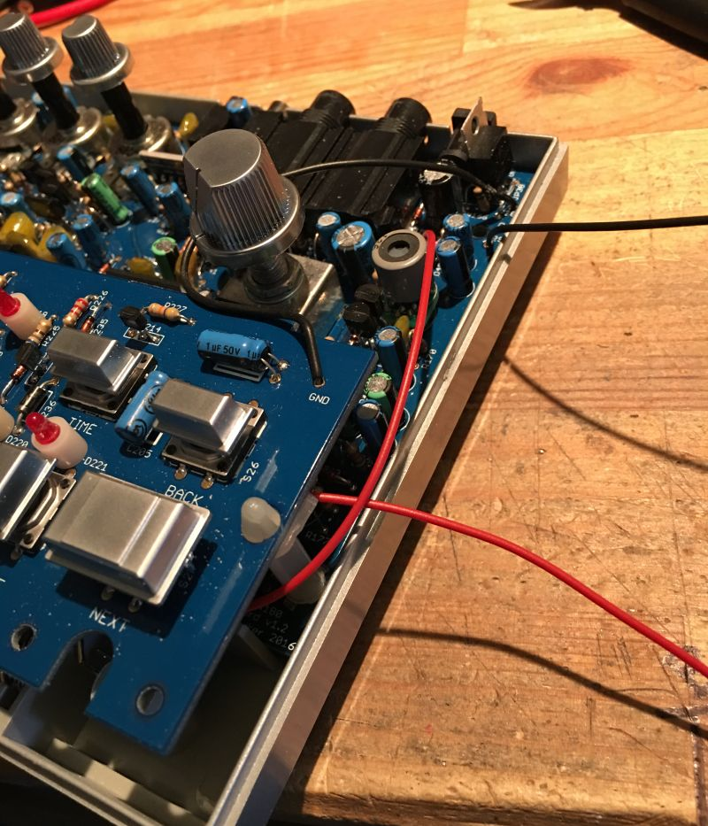
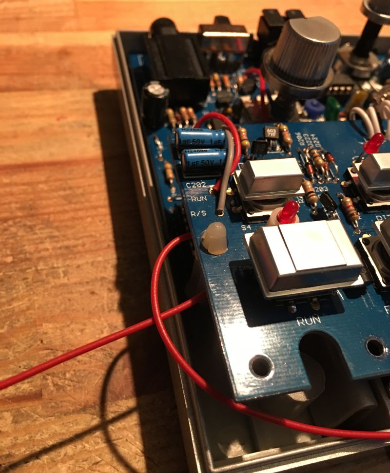
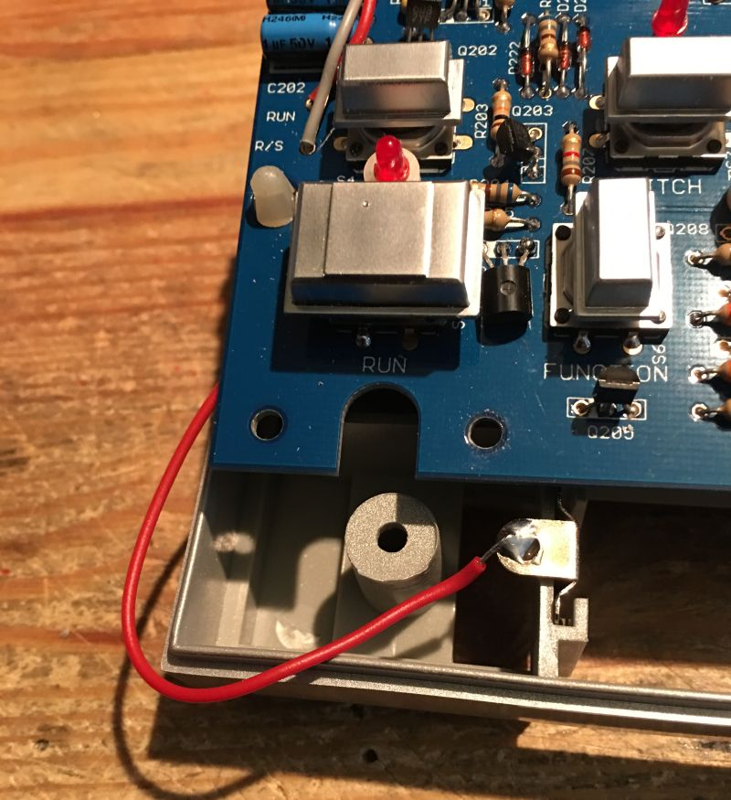
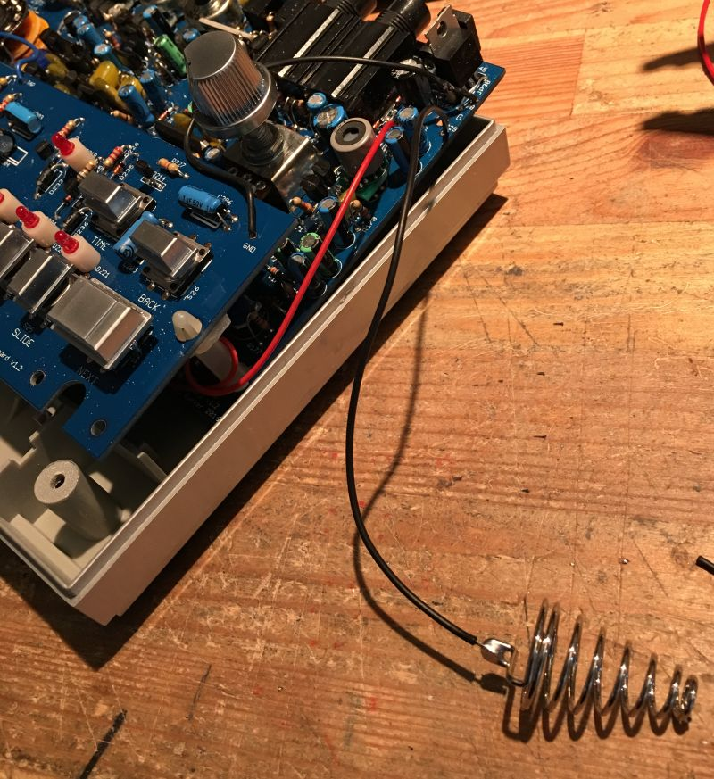

For this you’ll need some hookup wire, AWG24 should suffice. The colour doesn’t really matter but it’s less esoteric if we use different colours for the different sections. And it makes the utmost sense to use red and black for the battery connections.

Here’s a list of what you need to prepare.

CPU 24x 100mm  
RS 1x 115mm  
GND 1x 140mm  
RUN 1x 150mm  
TAP 1x 230mm

We will fit the battery wires at the very end so no need to cut them yet.

&nbsp;

Attach all the wires to the switchboard. Before you attach them to the mainboard you should place all the IC’s on the mainboard as it will be simpler to do before the wires are fitted.

The best place to start is the CPU lines, start at one end and solder all 24, then place the standoffs on, fit the boards together then solder the remaining wires.
 
Once that’s done we can fit the battery wires.

&nbsp;

**Fitting the battery wires**

The ground wire should be around 17cm and the positive should be around 70cm this gives a little extra so that you can trim to the correct length after placement.

&nbsp;

 Connect the wires as shown. The positive lead goes to P30 and the ground is either P28 or P29 depending on which ground you used for the switchboard (it doesn’t matter which ground point you use).

 &nbsp;

Wrap the red wire around the standoff

&nbsp;

And around the other standoff

&nbsp;

Take up some of the slack and then cut to length and solder. No need to pull it super tight, we aren’t fitting curtains.

&nbsp;

Now solder and fit the ground terminal. All done.