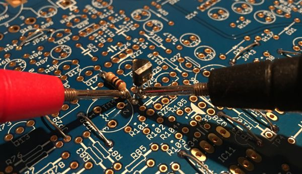

After placing and soldering the 52 jumpers we will place these parts.

R95 (100R)

R161 (1K)

R18 (47K)

D9 (1N4148)

Q24 (2SC536F or 2SC945P)

R95 is close to Q24, after fitting them both use a multimeter to make sure there is NO CONNECTION between R95 south and Q24 pin one (measure continuity as shown in the above picture).
