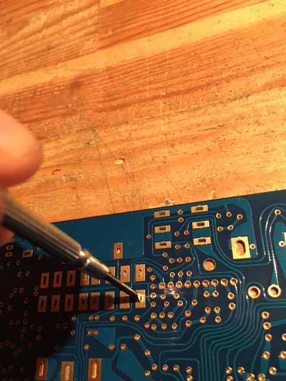
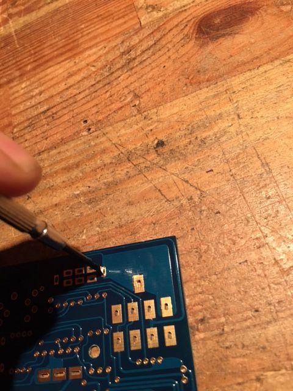

In this section we will add all the jumpers and place a few components that would be difficult to place later on.

*** NOTE ***

Due to some fluctuations in the production run, some boards may have tighter holes for the 6.3mm jacks. Test fit them, if they fit easily move on and fit the jumpers. If they don’t fit easily do not force them, instead you will need to widen the holes a small amount with a screwdriver.

&nbsp;

|||
|---|---|

Take a small flat head jewellers screwdriver and push it through the hole from the foil side, wiggle it a little to widen the hole.

Repeat for all the 6.3mm jack holes and the two outer pins of the switch. 

Your jacks should now fit with ease.