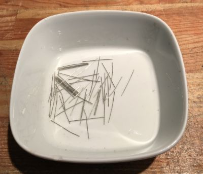

There are 52 jumpers named JPxx where xx is the number. You can use wire straps, 0 ohm resistors (not recommended for space) or simply old resistor legs.

||
|:--:| 
| *Here’s some I made from resistor legs.* |

||
|:--:| 
| *All 52 jumpers fitted.* |
