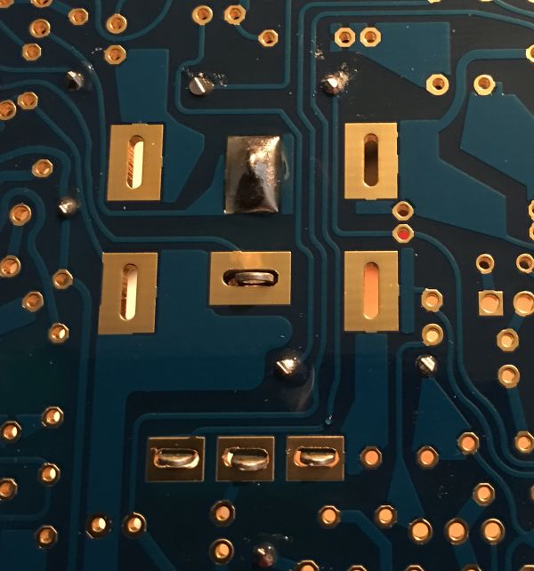

 

Now take VR8 (that’s the one with the integrated switch) and gently bend the legs out a little.

 

Place VR8 but only solder one pin of the switch.

 

Now check that VR8 is flush to the board and if so solder the remaining pins.

 

If you **_have_** metal pot brackets,

Place the bracket for VR8 and now you can also place and solder VR1 (tempo). It might be easier to loosely attach the bracket to the potentiometer before fitting.

&nbsp;

&nbsp;

If you **_do not have_**  metal pot brackets,

You can now place VR1 (tempo) but do not place this flush to the board like the switch, after soldering VR1 you can use the position and height of VR8 to gently form (bend) the potentiometer to the correct height.
You will need to make some wire straps to complete the internal ground circuits to reduce noise. Please note, these are not intended to be tight or in anyway to hold the potentiometer down. They are simply connecting all four points. Do this for both VR1 and VR8

&nbsp;

